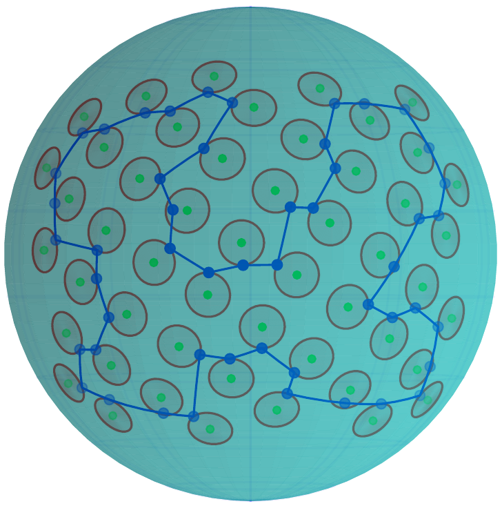

# Traveling Salesman Problem with Neighborhoods on a Sphere 

This repository provides benchmark instances of the Traveling Salesman Problem with Neighborhoods on a Sphere (TSPNS) motivated by the Reflectance Object Imagining (RTI).
The repository also provides the solutions of the TSPNS based on the transformation and discretization of TSPNS (TSPS-LKH, GTSP-GLKH) and on the direct GSOA method.
The solvers are introduced in 'Traveling Salesman Problem with Neighborhoods on a Sphere in Reflectance Transformation Imaging Scenarios' published in Expert Systems With Applications.

```
@article{deckerova2021traveling,
  title={Traveling Salesman Problem with Neighborhoods on a Sphere in Reflectance Transformation Imaging Scenarios},
  author={Jindri{\v{s}}ka Deckerov{\'a}, Jan Faigl, V\'{i}t Kr\'{a}tk\'{y}},
  journal={Expert Systems With Applications},
  year={2021},
  note={(in review)}
}
```

## TSPNS examples


## How to run provided solvers
The provided codes are in C++11 and utilize CRL (https://github.com/comrob/crl) and GLKH solver (http://webhotel4.ruc.dk/~keld/research/GLKH/)
To run the code, first run [install.sh](install.sh) to install CRL, GLKH, and necessary libraries (libcairo2-dev, liblog4cxx-dev, libboost-dev, and cache).

Then run [example.sh](example.sh):

```
make 

./tgsoa \
  --problem=etc/sphere_rand_ol_100x1.tsp

./tgsoa \
  --problem=etc/sphere_rand_ol_100x1.tsp \
  --lkh 1

./tgsoa \
  --problem=etc/sphere_rand_ol_100x1.tsp \
  --glkh 1 \
  --glkh-instance=etc/gtsp/sphere_rand_ol_100x10.gtsp 
```

All possible configuration flags can be displayed by `./tgsoa -h`. 